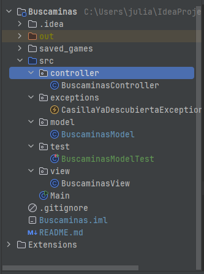

# 📌 **Buscaminas**

---

## 📋 **Descripción del Proyecto**

Este proyecto implementa el clásico juego de **Buscaminas** en Java. Incluye un modelo funcional con la lógica necesaria para gestionar el tablero, las minas, el estado del juego y las interacciones del usuario. El modelo está diseñado para ser flexible y reutilizable, permitiendo jugar con diferentes configuraciones de tamaño y número de minas.

---

## 🚀 **Características**

- Generación de un tablero de tamaño 10x10 por defecto.
- Lógica para colocar minas de forma aleatoria.
- Cálculo automático de los números alrededor de las minas.
- Métodos para revelar casillas, marcar minas y determinar el estado del juego (victoria o derrota).
- Almacenamiento del estado del juego en un archivo para guardar y cargar partidas.
- Tests unitarios implementados para validar la funcionalidad del modelo.

---

## 🛠️ **Tecnologías Utilizadas**

- **Java**: Lenguaje de programación principal.
- **JUnit 5**: Para la implementación y ejecución de pruebas unitarias.
- **IDE recomendado**: IntelliJ IDEA (compatible con otros entornos).

---

## 📂 **Estructura del Proyecto**




### Descripción de los Archivos
- **BuscaminasModel.java**: Clase principal que contiene la lógica del juego.
- **BuscaminasView.java**: Clase principal que contiene la vista del juego.
- **BuscaminasController.java**: Clase principal que une la lógica del juego con su respectiva vista.
- **CasillaYaDescubiertaException.java**: Excepción personalizada para manejar errores al intentar revelar una casilla ya descubierta.
- **BuscaminasModelTest.java**: Pruebas unitarias que validan la funcionalidad del modelo.

---

## 📦 **Cómo Ejecutar el Proyecto**

1. **Clonar el repositorio**:
   ```bash
   git clone <URL_DEL_REPOSITORIO>
   cd <NOMBRE_DEL_PROYECTO>

### 2. **Abrir en IntelliJ IDEA**
1. Abre IntelliJ IDEA y selecciona `Open Project`.
2. Dirígete al directorio donde clonaste el repositorio.
3. Asegúrate de configurar el SDK de Java correctamente en `File > Project Structure > SDKs`.

### 3. **Ejecutar los Tests**
1. Haz clic derecho sobre la carpeta `test` y selecciona `Run All Tests`.
2. Alternativamente, abre el archivo `BuscaminasModelTest.java`, haz clic derecho y selecciona `Run`.

### 4. **Ejecutar la clase Main**
1. Abre la clase Main y haz click en play.
2. Empieza a jugar😉.

## ✅ **Pruebas Unitarias**
Ejecuta las pruebas para validar la lógica del modelo directamente desde IntelliJ IDEA.
Las pruebas verifican:
- **Colocación correcta de minas y números.**
- **Revelado de casillas.**
- **Gestión del estado del juego (victoria, derrota).**
- **Guardado y carga del estado del juego.**

## 🏆 **Estado del Proyecto**
El proyecto es completamente funcional, pero puede mejorarse:
- **Agregar una interfaz gráfica (por ejemplo, usando Swing o JavaFX).**
- **Mejorar la lógica para tableros de tamaño configurable.**
- **Incluir niveles de dificultad predefinidos.**

## 💡 **Contribuciones**
¡Las contribuciones son bienvenidas! Si deseas colaborar:
1. **Haz un fork del proyecto.**
2. **Crea una nueva rama para tu funcionalidad (git checkout -b nueva-funcionalidad).**
3. **Realiza los cambios y realiza un commit (git commit -m "Añadida nueva funcionalidad").**
4. **Envía un pull request.**

## 📝 **Licencia**
Este proyecto está bajo la licencia MIT. Consulta el archivo LICENSE para más detalles.

## 📧 **Contacto**
Si tienes preguntas o sugerencias, no dudes en contactarme. 😊
- **juliandev26@outlook.com**